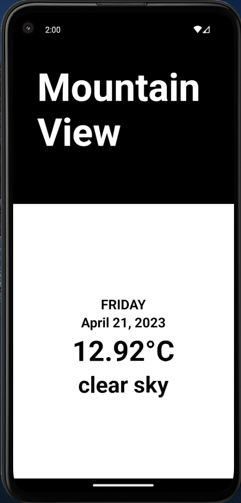

# Weather Forecast

This is a simple React Native app that shows the weather forecast for the user's current location. The app uses the OpenWeatherMap API to fetch the weather data.

## Features

- Shows the current weather and forecast for the user's current location
- Shows the date, temperature, description, and weather icon for each forecasted day
- Allows the user to swipe horizontally to view the forecast for the next day

## Getting Started

To run this app on your local machine, you will need to have the following:

- Node.js
- Expo CLI

To install the dependencies and start the app, run the following commands:

npm install
npm start

This will start the Expo development server and open the app in a new browser window.

## Screenshots

## License

This project is licensed under the MIT License - see the [LICENSE](LICENSE) file for details.
